# DSub for Plex

A fork of [DSub](https://github.com/daneren2005/Subsonic), the Subsonic client for Android, that adds a **Plex backend** and brings the app up to date for **Android 16**. Subsonic servers still work as before. Each server in the app is set to either Subsonic or Plex.

Along with Plex support, this fork adds a new look (a black or a white theme), a Home screen, time-synced lyrics, casting to Sonos and DLNA speakers, a new audio engine with crossfade and high-resolution output, a headphone equalizer, and new ways to play a playlist.

<p align="center">
  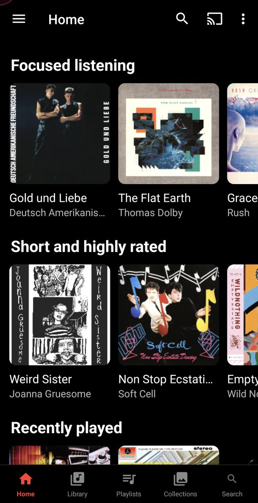
  &nbsp;
  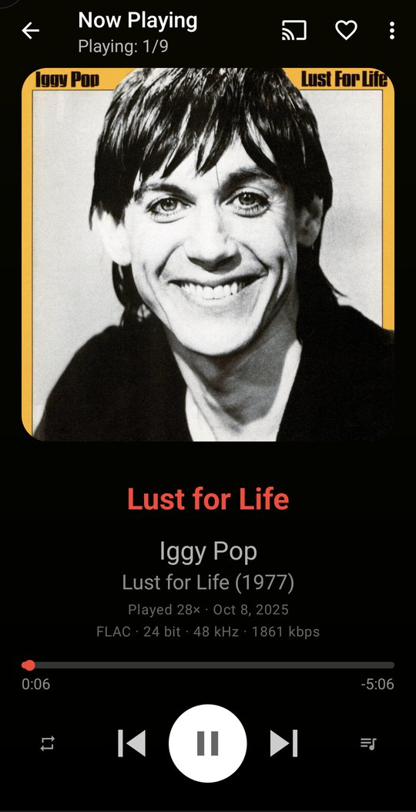
  &nbsp;
  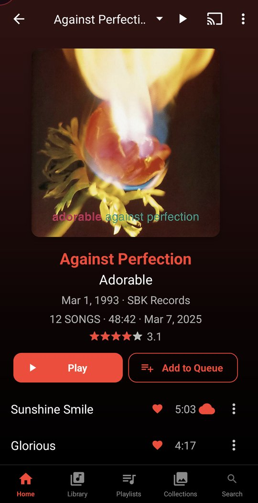
</p>

---

## Contents

- [Plex backend](#plex-backend)
- [A redesigned app](#a-redesigned-app)
- [Home](#home)
- [Now Playing](#now-playing)
- [Albums, artists and the library](#albums-artists-and-the-library)
- [Collections](#collections)
- [Playlists: mixes and Flow](#playlists-mixes-and-flow)
- [Sonic radio](#sonic-radio)
- [Casting to Sonos and DLNA](#casting-to-sonos-and-dlna)
- [Audio engine](#audio-engine)
- [Equalizer and headphone correction](#equalizer-and-headphone-correction)
- [Downloads, cache and offline](#downloads-cache-and-offline)
- [Plex Dashboard integration (optional)](#plex-dashboard-integration-optional)
- [Security and networking](#security-and-networking)
- [Building](#building)
- [Credits and licence](#credits-and-licence)

---

## Plex backend

Plex runs next to Subsonic rather than replacing it. You choose a server type for each server, and features Plex has no equivalent for (podcasts, jukebox, chat, shares, admin) are hidden rather than left to fail.

- **Sign in with your Plex account.** The app gets a token from plex.tv, so it never stores your Plex password.
- **Browsing**: library sections, artists, albums, playlists, collections, search and ratings.
- **Full discographies.** An artist's page lists every release, including EPs, singles and live records, not only what Plex files as "albums".
- **Shows on the Plex dashboard.** Playback is reported to Plex's timeline, so it appears on the server dashboard and updates play counts.
- **Lossless is never transcoded**, whatever bitrate limit you set.
- **Uses the internal address at home.** When the phone is on your home Wi-Fi, requests go to the server's LAN address. This still works with an always-on VPN, and with the screen off, when Android stops telling apps the Wi-Fi network's name.

## A redesigned app

The interface has been restyled throughout:

- **A modern Black theme** with true-black surfaces and a single red accent, and a matching **White theme**.
- **A bottom bar** with Home, Library, Playlists, Collections and Search. Everything else is still in the drawer. Tapping the tab you're on takes you back to its top screen.
- **A new drawer** with a flat header, the current screen shown as a pill, and a **Clear Cache** row that shows how much space it will free.
- **An adaptive launcher icon**, including a themed (Material You) version.
- One consistent layout for list rows, bigger touch targets, readable caption text, and artwork with rounded corners.
- **Opens straight to Now Playing** if music is playing when you launch the app.

<p align="center">
  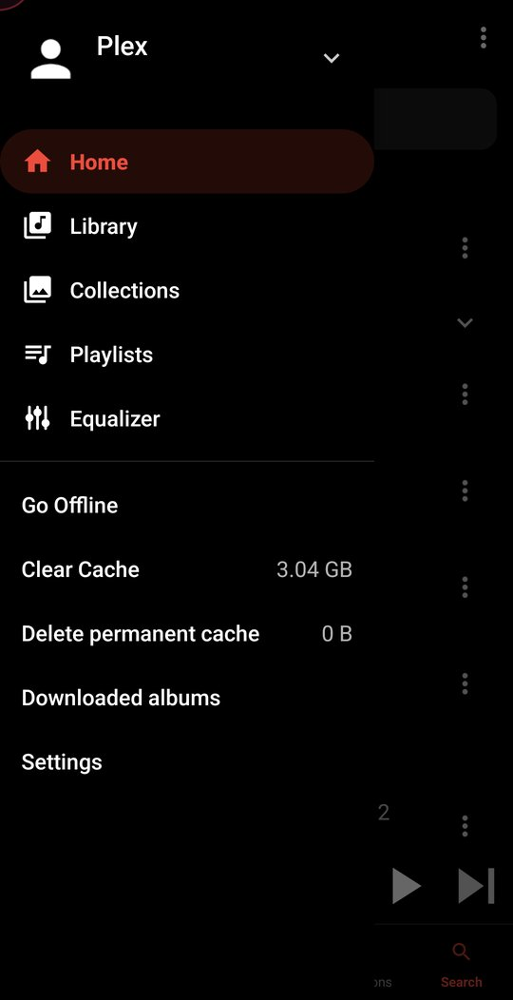
  &nbsp;
  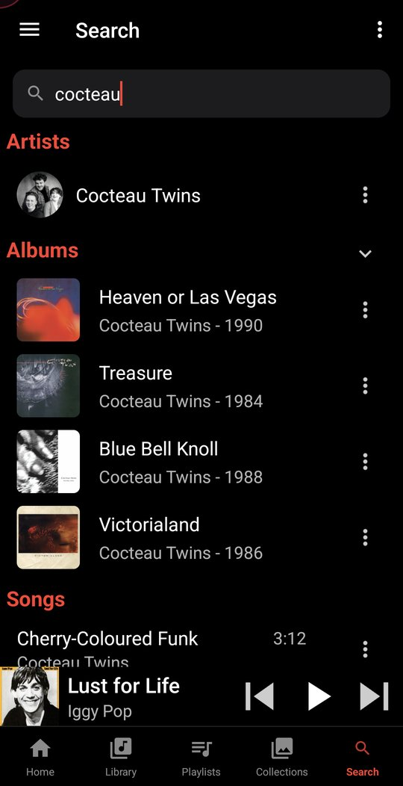
</p>

**Search** shows results as you type, grouped into artists, albums and songs.

## Home

Home is built around album art:

- **Focused listening**: the albums of one collection you pick, with any of the collection filters applied. Use it to work through a short list rather than look for it every time. The choice is saved per server.
- **Worth revisiting**: well-rated albums you haven't played for six months.
- **Short and highly rated**: albums rated three stars or more, with more than three tracks, under thirty minutes, and not played for ninety days.
- **Recently played**, **Recently added**, **Downloaded albums** and **Playlists**.
- Shortcut tiles to everything the old Home screen offered.

Each carousel loads on its own, so a slow one doesn't hold up the screen. The "Short and highly rated" pool is cached for a week and refreshed in the background, but each visit shows a new random selection from it.

> **Note:** some carousels read specific Plex collections. "Worth revisiting" and "Short and highly rated" look for collections named `3 stars` and `4 stars and over`, and "Short and highly rated" starts from `EPs and short albums`. If your library has no collections with those names, the carousels stay hidden.

## Now Playing

<p align="center">
  
  &nbsp;
  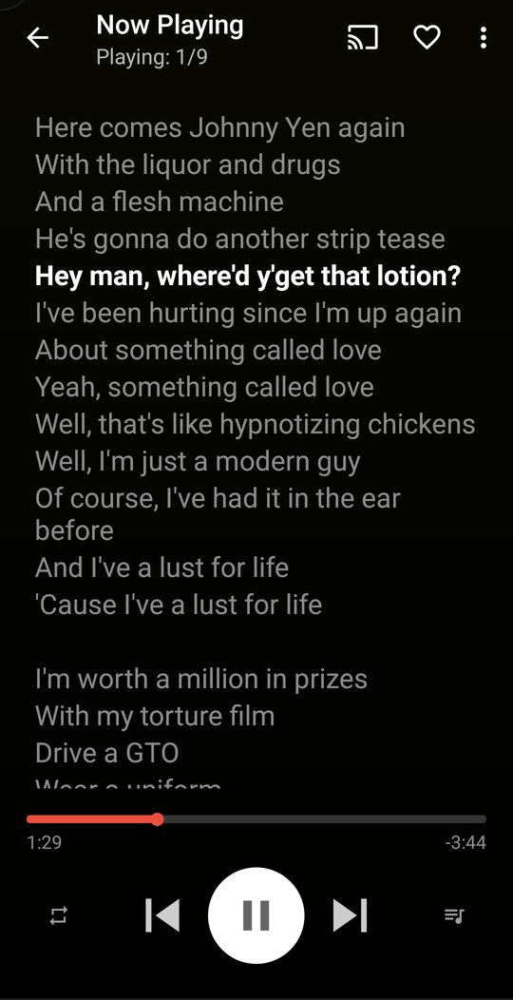
  &nbsp;
  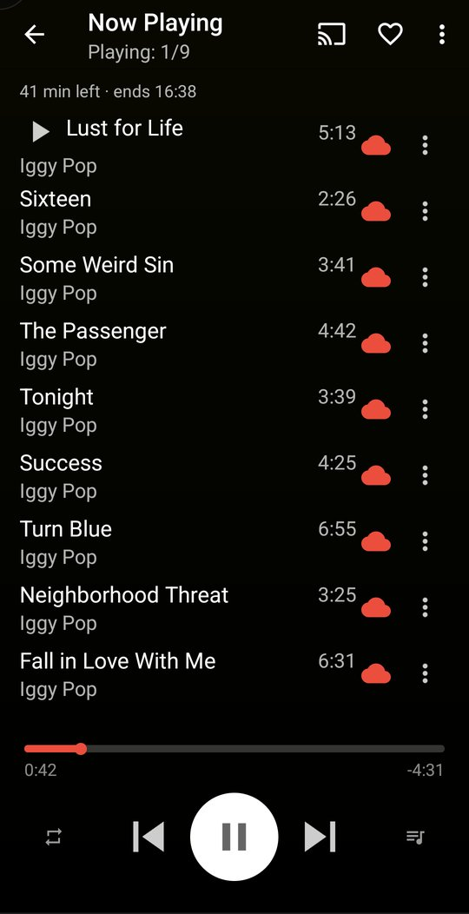
</p>

- **Large artwork on a background coloured from the album art.** The colour is kept dark enough for white text to stay readable.
- **Titles fit instead of being cut off.** Long titles shrink onto two lines rather than ending in "…".
- **Shows what's actually playing**, for example `FLAC · 24 bit · 48 kHz · 1861 kbps`.
- **Play count and last played**, from Plex.
- **Time-synced lyrics** from the LRC files Plex stores. The current line is highlighted and kept in the middle. Lyrics files that contain an error message instead of lyrics are ignored.
- **Time left in the queue and when it will end** ("41 min left · ends 16:38"). This is hidden when it can't be known, such as with repeat or autoplay on.
- **Loving tracks on Last.fm**, through the [Plex Dashboard](#plex-dashboard-integration-optional).
- **Long-press play or pause** to stop and clear the queue. When a queue finishes, the mini player goes away instead of showing the first song again.
- **Go to album** from Now Playing and from songs in a playlist.

## Albums, artists and the library

<p align="center">
  
  &nbsp;
  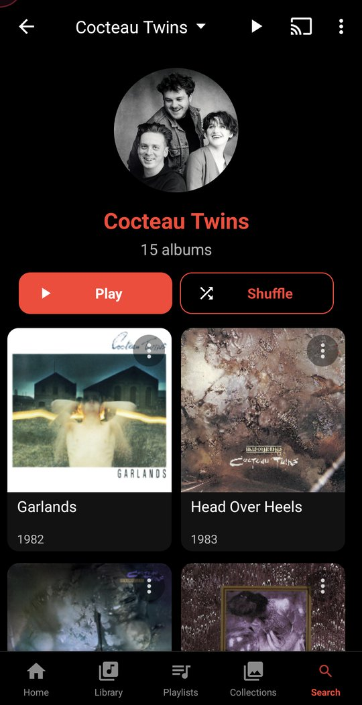
  &nbsp;
  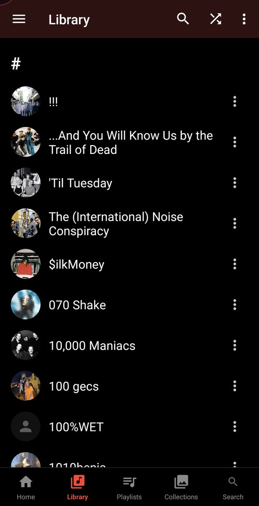
</p>

- **Album screens** lead with the cover at full resolution. The screen, toolbar and status bar take their colour from the cover. The header shows the **original release date and label**, **when you last listened to the album**, and (with the [Plex Dashboard](https://github.com/alexandrutirdea/Plex-Dashboard)) its **rating and which tracks you've loved on Last.fm**. Play and Add to Queue buttons sit under the header.
- **"Last listened" counts the album itself.** Hearing one song from an album in a mix doesn't mark the whole album as listened to.
- **Track rows** don't repeat the album artist on every line, keep track numbers aligned, and mark downloaded tracks with a red cloud.
- **Artist pages** have a header with the artist's picture and a grid of every release.
- **The Library** shows artist pictures, with A–Z sections.
- **Offline album screens** still show the year, release date and last played, saved from when you last opened them online.
- **A cast button** on album and album-list screens, so you can send an album to a speaker without playing it on the phone first.

## Collections

<p align="center">
  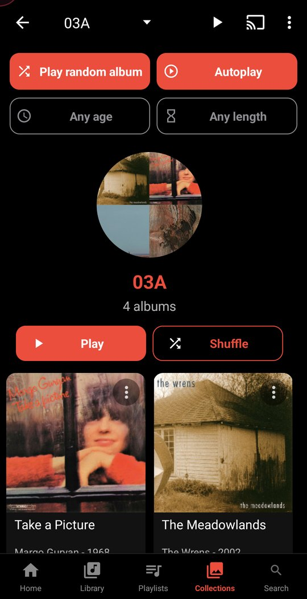
</p>

Plex collections get their own tab, with:

- **Play random album** and **Autoplay**. Autoplay plays whole albums at random from the collection, one after another, without repeating one and without the same artist twice in a row. The queue only holds the album you're listening to.
- **Filters** for how long since an album was last played (30 days to 5 years), length, genre, decade and track count. A filter stays outlined until it's set, then fills with red. The details needed for filtering are fetched once and kept.
- **A name filter** on the list of collections.
- **Self-emptying collections.** Albums played from collections named `01A` to `05A` are removed from that collection, so those collections work like to-listen lists. This also works during autoplay, and autoplay stops once the collection is used up.
- Caching a filtered collection only downloads the albums the filters leave showing.

## Playlists: mixes and Flow

<p align="center">
  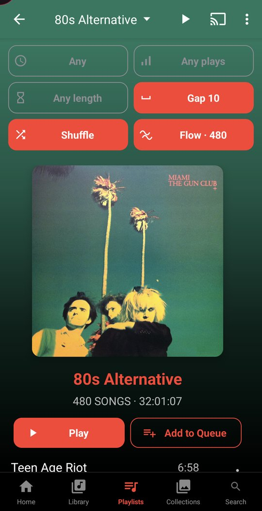
</p>

Each playlist has mix controls. The filters narrow down which tracks are used, and **Shuffle** and **Flow** play what's left:

- **Skip recently played**: leave out tracks played in the last N days, up to ten years.
- **Play count**: enter a minimum, a maximum or both. A maximum brings up tracks you've neglected, a minimum finds old favourites.
- **Track length**: over, under or between two lengths.
- **Artist gap**: keep the same artist at least N tracks apart.
- **Shuffle** shows how many tracks it will queue.
- **Flow** orders the tracks by how they sound, so the playlist holds together. It uses what Plex has measured about each recording: how loud it is, its dynamic range and whether it has vocals. Rather than going from quietest to loudest, it moves between similar-sounding neighbours while still keeping the artist gap. It comes out differently each time you press it. Tracks Plex hasn't analysed are spread evenly through the order.

You can also set a separate **number of songs to preload while playing a playlist**, and there are new preload options of 20, 30, 40 and 50 songs.

## Sonic radio

<p align="center">
  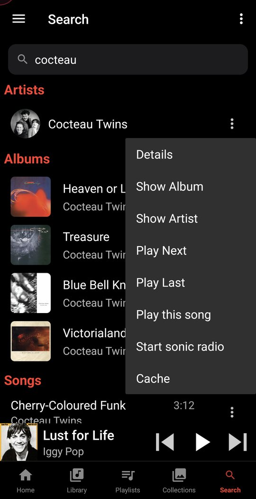
</p>

**Start sonic radio** from any song's menu to get a station of tracks that *sound* like it. It uses Plex's sonic analysis, or `getSimilarSongs2` on Subsonic. The station keeps moving: each new batch is based on the latest track rather than the original song, so it doesn't repeat itself or double back.

## Casting to Sonos and DLNA

<p align="center">
  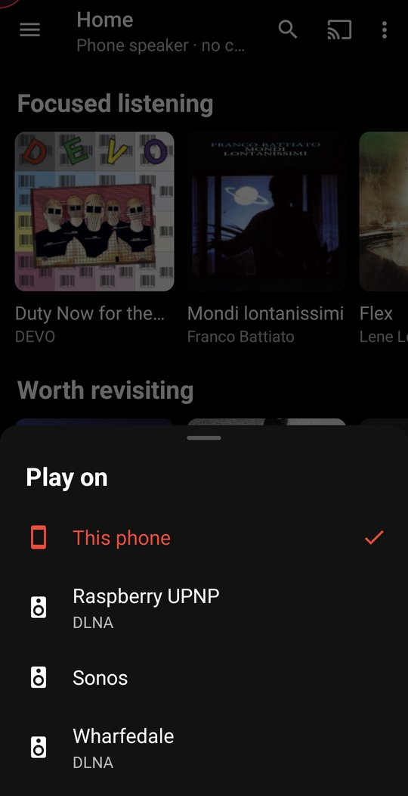
</p>

The cast button opens a **Play on** sheet in the app's own style. It lists the phone (or the Bluetooth headphones it's playing through) followed by the speakers found on your network. Each speaker has its own volume slider.

- **Sonos**: DSub copies the whole queue onto the speaker, so playback is **gapless**, and follows the speaker as it moves through the queue. Grouped speakers show as one entry per group.
- **DLNA / UPnP renderers**: renderers that support it get the next track ahead of time, so playback is gapless on those too.
- **Casting from the phone's cache.** Each track is sent from the phone if it has already downloaded, or from the server if it hasn't. The first track waits briefly for its download, so casting doesn't fetch the same song twice. If the server cuts a stream short, the rest is sent from the downloaded copy.
- **Casts keep going with the screen off.** The phone stays awake while a cast is playing.
- Reordering the queue updates the speaker's order too, and autoplay, radio and shuffle keep adding tracks during a cast.

## Audio engine

<p align="center">
  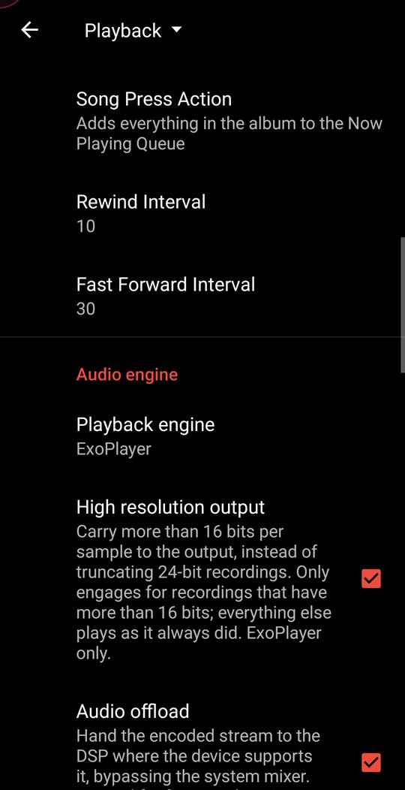
</p>

A new **ExoPlayer (Media3) engine** is available alongside the original Android player (**Settings → Playback → Playback engine**):

- **Plays a song while it's still downloading**, reading straight from the partial file.
- **High-resolution output** keeps 24-bit recordings at full resolution instead of cutting them to 16 bits. 16-bit tracks play exactly as before.
- **Audio offload** passes the audio to the phone's DSP when the phone supports the format.
- **Current output path** shows what's really happening, for example `FLAC 48 kHz 24-bit stereo, decoded to float -> mixer at 48 kHz`.
- **Replay gain is applied to the audio itself, per track**, so the new track starts at its own level from its first sample. It also works for **streamed tracks**: the gain is read from the start of the partial file, or from Plex if the file can't answer. Smart mode picks album gain when you're playing a whole album in order.
- **Crossfade** (off by default) plays two tracks at once during the change, keeping the volume steady through the fade. It **adjusts each crossfade to the two tracks**: it measures how each track starts and ends as it plays, so a track that already fades out doesn't get a second fade on top. **Albums are never crossfaded.**

## Equalizer and headphone correction

<p align="center">
  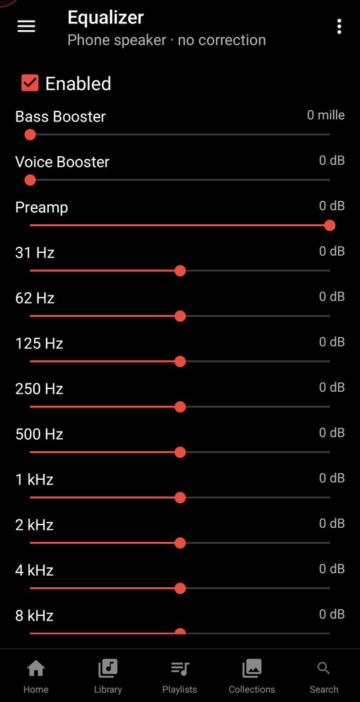
</p>

A rebuilt equalizer, reached from the drawer:

- A **10-band graphic equalizer** with preamp, bass boost and voice boost.
- **Headphone correction** using [AutoEq](https://github.com/jaakkopasanen/AutoEq) profiles. Choose your headphone model and its measured correction curve is downloaded and applied. The profile follows the device you're listening on, so correction for your headphones switches off when you go back to the phone speaker.

## Downloads, cache and offline

- **Downloads are organised by artist and album** on Plex (previously each track landed in a numbered folder of its own). Compilations stay together in one folder under the album artist. Existing downloads are moved automatically, once.
- **Downloaded albums** row on Home and entry in the drawer: complete albums on the phone, newest first, which also works offline.
- **Clear Cache no longer deletes pinned downloads.** A separate **Delete permanent cache** option does that, after asking. Both show how much space they'll free.
- Preloading now follows the queue after you reorder or shuffle it.

## Plex Dashboard integration (optional)

Some features talk to a **[Plex Dashboard](https://github.com/alexandrutirdea/Plex-Dashboard)**, a separate self-hosted companion service that tracks what Plex is playing and holds your Last.fm loves and album ratings. Set it up under **Settings → Playback → Plex Dashboard**:

| Setting | Purpose |
|---|---|
| Dashboard address | Public base URL of the dashboard |
| Dashboard address on the local network | Tried first. Useful when your router can't reach the public address from inside your network |
| Access key | The key the dashboard expects on `/api/love` |

With it configured you get the **love button** on Now Playing, and the **rating and loved-track hearts** on album screens. Your Last.fm credentials stay on the dashboard and never reach the app. If no address is set, these features are hidden.

## Security and networking

- **Certificates are checked.** The original app accepted any certificate from any server, which left your Subsonic password and Plex token readable by anyone on a shared network who could pose as the server. Now checking is on by default, with an **allow self-signed certificate** checkbox for each server. Certificates you install on the phone yourself are also trusted, so installing your server's own certificate is an alternative to the checkbox.
- Plain `http` still works for servers on your LAN.
- Android 13+ asks for notification permission, so the playback controls show up.

## Under the hood

- Gradle 8.11, Android Gradle Plugin 8.10, Java 17, `compileSdk`/`targetSdk` 36, `minSdk` 21.
- Moved to AndroidX, with the settings screens on `androidx.preference`. They previously relied on reflection that could stop working on a future Android.
- ServerProxy is now part of the app module instead of a separate submodule, so a fresh clone builds as-is.
- Fixes for the Android 12–16 behaviour changes that crashed the app on launch (PendingIntent mutability, receiver export flags, foreground-service rules, scoped storage, predictive back).
- Many older bugs fixed along the way, including:
  - downloads being spliced into the play queue while caching;
  - the first song being scrobbled again when a cast queue ended;
  - background tasks being silently dropped when more than ten were waiting;
  - an artist's photo replacing the cover of their self-titled album;
  - the last row of every list hidden under the navigation bar;
  - the Library crashing when the app went to the background.

## Building

Requirements: **JDK 17** and the **Android SDK** with platform 36 and build-tools 36.0.0.

```sh
git clone <this repository>
cd <repository folder>
./gradlew assembleDebug        # APK in app/build/outputs/apk/debug/
./gradlew testDebugUnitTest    # unit tests
```

The debug build is signed with the `debug.keystore` in the repository, so no signing setup is needed.

> **Installing:** the app keeps DSub's package name (`github.daneren2005.dsub`) but is signed with a different key. To install it, first uninstall any copy of DSub from Google Play. Note that uninstalling removes that copy's settings and downloads.

## Credits and licence

Based on **DSub** by Scott Jackson and its contributors: <https://github.com/daneren2005/Subsonic>. Headphone correction profiles come from [AutoEq](https://github.com/jaakkopasanen/AutoEq) by Jaakko Pasanen.

Licensed under the **GNU General Public License v3.0**. See [LICENSE.txt](LICENSE.txt). This fork is not affiliated with Plex, Sonos or the original DSub project.
